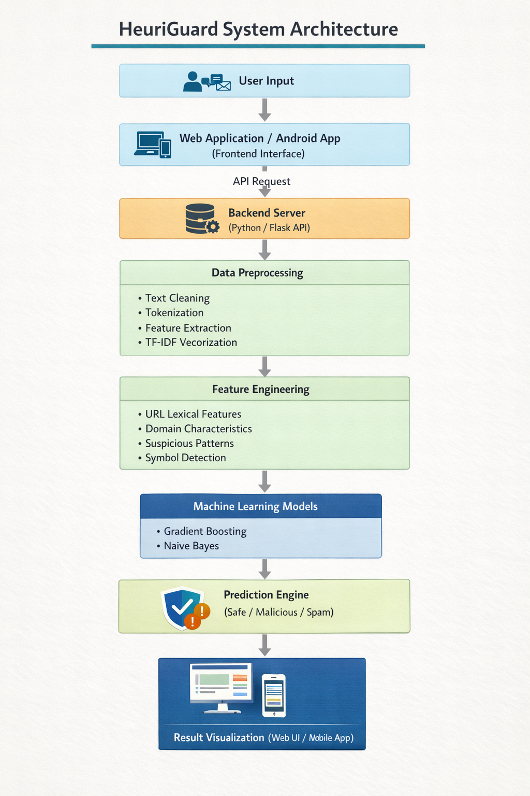

  

**HeuriGuard: A Hybrid Machine Learning System for Malicious URL Detection and SMS Spam Classification**

HeuriGuard is an intelligent cybersecurity system designed to detect malicious URLs, phishing links, and SMS spam using a hybrid rule-based and machine learning approach.

The system integrates Natural Language Processing (NLP) and URL feature analysis to provide real-time threat detection across multiple communication channels.

---

# 🚀 Project Overview

With the rapid growth of digital communication, cyber threats such as phishing attacks, malicious URLs, and spam messages have become increasingly common.

HeuriGuard addresses this challenge by combining machine learning models with rule-based analysis to detect harmful digital content efficiently.

The system supports detection of:

• Malicious URLs  
• Phishing attacks  
• SMS spam messages  

Users can input URLs or message content and receive instant predictions indicating whether the content is safe or potentially malicious.

---

# 🧠 Key Features

• Hybrid rule-based and machine learning detection  
• Malicious URL analysis using lexical features  
• SMS spam detection using NLP techniques  
• Real-time prediction through a web interface  
• Android mobile application support  
• Custom domain deployment

---

# ⚙️ Technologies Used

## Programming
- Python
- JavaScript

## Machine Learning
- Gradient Boosting
- Naïve Bayes
- Scikit-learn

## Natural Language Processing
- Tokenization
- TF-IDF Vectorization
- Text Feature Extraction

## Web Development
- HTML
- CSS
- JavaScript
- Flask API

## Mobile Application
- Android Studio

---

# 📊 Model Performance

SMS Spam Detection

Precision: **97%**

The model was trained using labeled datasets and evaluated using standard machine learning performance metrics.

---

# 🏗 System Architecture

The system follows a multi-stage pipeline:

User Input → Data Preprocessing → Feature Extraction → Machine Learning Model → Prediction Output

The backend processes input data and returns real-time classification results to the user interface.

---

# 🌐 Live Application

Web Application:

https://heuriguard.mdjaveedkhan.me

Portfolio:

https://mdjaveedkhan.me

---

# 📱 Mobile Application

An Android mobile application was developed using Android Studio to extend the accessibility of the system.

The APK version allows users to analyze URLs and SMS messages directly from their mobile device.

---

# 📂 Dataset

The training dataset was collected from publicly available cybersecurity datasets including Kaggle.

The dataset contains labeled samples of both legitimate and malicious URLs and SMS messages.

---

# 🔬 Future Improvements

• Deep learning based threat detection  
• Browser extension for real-time link protection  
• Larger cybersecurity datasets  
• Improved phishing detection algorithms

---

# 📄 Research Direction

This project is being extended for:

• Research publication  
• Cybersecurity model improvement  
• Hybrid threat detection frameworks

---

# 👨‍💻 Author

**MD JAVEED KHAN**

Computer Science and Engineering Student  
Machine Learning & AI Enthusiast

Portfolio  
https://mdjaveedkhan.me

LinkedIn  
https://linkedin.com/in/mdjaveedkhan

Email  
mdjaveed1802@gmail.com

© 2026 Md Javeed Khan
This project is for academic and research purposes.
Unauthorized reproduction of the complete system is discouraged.
